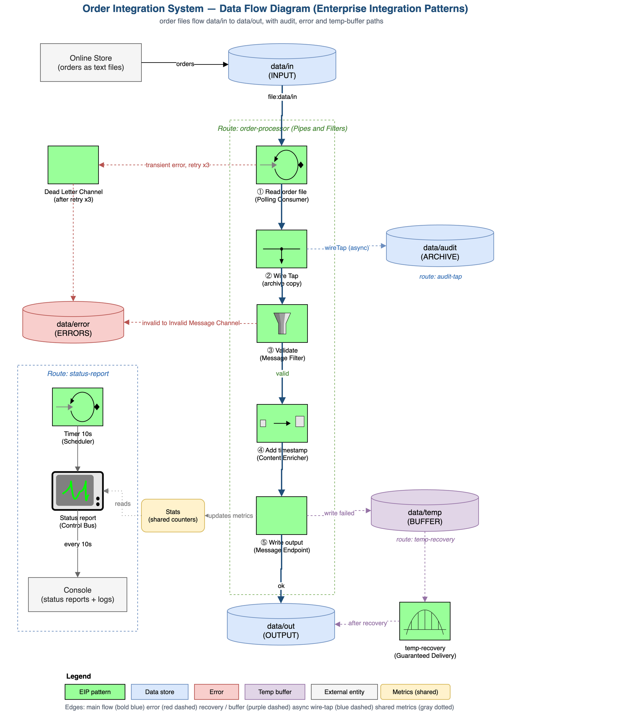

# Order Integration System

A small but **resilient file-based order-processing pipeline** built with **Apache Camel**. It watches an input folder for customer order files, validates and enriches each one with a receipt timestamp, writes the result out — and keeps running no matter what errors occur along the way.


---

## Overview

Imagine an online store that receives customer orders as plain-text files. Each file holds one order — `customer, product, quantity, price`. This project is a lightweight **ETL / integration pipeline** that:

- **Extracts** — polls the `data/in` folder and picks up new order files,
- **Transforms** — validates the order and appends the receipt time (`timestamp`),
- **Loads** — writes the processed order to `data/out`,

while staying up under failure conditions (locked files, an unavailable output folder, empty or malformed input) and printing a health report every 10 seconds.

## Architecture

The pipeline is modeled as a Data Flow Diagram using Enterprise Integration Patterns (EIP). Order files enter through `data/in` and flow along the main **order-processor** route to `data/out`, with dedicated paths for auditing, error handling, and temp buffering, plus an independent **status-report** route.



> Editable source: [`order-integration-system.drawio`](docs/diagrams/order-integration-system.drawio) — open with [draw.io](https://app.diagrams.net/).

## Features

- **Automatic polling** of the input folder (no manual trigger).
- **Validation** — empty or incomplete orders are rejected, logged, and set aside.
- **Timestamp enrichment** — receipt time is added as a fifth CSV field on the same line.
- **Three resilience scenarios** — retry, buffering, and skip-and-continue (see below).
- **Wire Tap audit trail** — a raw copy of every order is archived asynchronously.
- **Health report** printed to the console every 10 seconds.
- **Test suite** built with the official Camel Test Kit (`camel-test-junit5`).

## Resilience scenarios

For transient processing failures, the system retries up to three times with a 1-second delay before moving the file to data/error and continuing with the next item.

If the output directory (data/out) is unavailable, the system temporarily stores the data in data/temp and later recovers it once the directory becomes accessible.

For empty or malformed files (fewer than four fields), the system logs the issue, moves the file to data/error, and proceeds with processing without interruption.

## Enterprise Integration Patterns

| Pattern | Where |
|---------|-------|
| **Pipes and Filters** | The main route: read → validate → transform → write |
| **Content Enricher** | `OrderTransformer` — appends the timestamp |
| **Polling Consumer** | `from("file:data/in?delay=3000")` |
| **Wire Tap** | `wireTap("direct:audit")` — asynchronous archive copy |
| **Dead Letter Channel** | `moveFailed=../error` + error handler |
| **Invalid Message Channel** | Validation failures routed to `data/error` |
| **Guaranteed Delivery** | Temp buffering + redelivery |

## Tech stack

- **Java 21** (LTS)
- **Apache Camel 4.8** (`camel-main`, `camel-file`, `camel-timer`, `camel-bean`, `camel-direct`)
- **Maven** for build & dependency management
- **JUnit 5** + **camel-test-junit5** for testing
- **SLF4J** (slf4j-simple) for console logging

## Project structure

```
order-integration/
├── pom.xml
├── src/
│   ├── main/java/com/uls/order/
│   │   ├── MainApp.java              # entry point — starts the Camel context
│   │   ├── OrderProcessorRoute.java  # main route + error handling + wire tap + recovery
│   │   ├── StatusReportRoute.java    # prints a health report every 10s
│   │   ├── OrderValidator.java       # rejects empty / incomplete orders
│   │   ├── OrderTransformer.java     # appends the receipt timestamp
│   │   ├── InvalidOrderException.java
│   │   └── Stats.java                # thread-safe counters
│   └── test/java/com/uls/order/
│       ├── OrderProcessorRouteTest.java
│       ├── OrderValidatorTest.java
│       └── OrderTransformerTest.java
└── data/
    ├── in/     # input order files
    ├── out/    # processed orders (with timestamp)
    ├── error/  # rejected / failed orders
    ├── temp/   # temporary buffer when output is unavailable
    └── audit/  # raw archived copies (wire tap)
```

## Getting started

### Prerequisites

- **JDK 21** (`java -version` should report 21)
- **Maven 3.9+** (`mvn -version`)

### Build

```bash
mvn compile
```

### Run

```bash
mvn exec:java
```

The app starts polling `data/in`. Drop an order file there and watch it flow to `data/out`. Stop with `Ctrl+C`.

### Test

```bash
mvn test
```

## Visualize the routes (Hawtio)

The app registers with the Camel CLI (via `camel-cli-connector`), so you can view the routes in the [Hawtio](https://hawt.io/) web console.

```bash
brew install jbang
jbang app install camel@apache/camel
jbang trust add https://github.com/apache/camel/

# with the app running (mvn exec:java), in another terminal:
camel ps                        # find the app NAME 
camel get route                 # list routes in the terminal
camel hawtio <app-name> --openUrl  # open Hawtio dashboard
```

## Screenshots

See **[docs/SCREENSHOTS.md](docs/SCREENSHOTS.md)** for a visual walkthrough — Hawtio route diagrams, runtime and error logs, test results, and data-flow results.

## Reports

Written deliverables live in **[docs/reports/](docs/reports/)**:

- [**Phase 1 — Process design & Data Flow Diagram**](docs/reports/phase1-report.pdf) (PDF, Persian)
  - Editable LaTeX source: [`docs/reports/phase1-latex/`](docs/reports/phase1-latex/) — see its [README](docs/reports/phase1-latex/README.md) for how to compile (XeLaTeX).

## Input & output format

Each input file contains **one order** as a single comma-separated line:

```
customerName,product,quantity,price
```

Example — `data/in/order1.txt`:

```
Saeed,Laptop,1,25000000
```

After processing, `data/out/order1.txt` gets the receipt time appended as a fifth field:

```
Saeed,Laptop,1,25000000,2026-07-05 02:26:16
```

## Sample console report

```
System status report - 2026-07-05 02:26:20
   Report thread : Camel (camel-1) thread #3 - timer://status
   Status        : running and healthy
   Processed     : 3
   Failed        : 2
   Buffered(temp): 0
```

## License

Released under the [MIT License](LICENSE).
