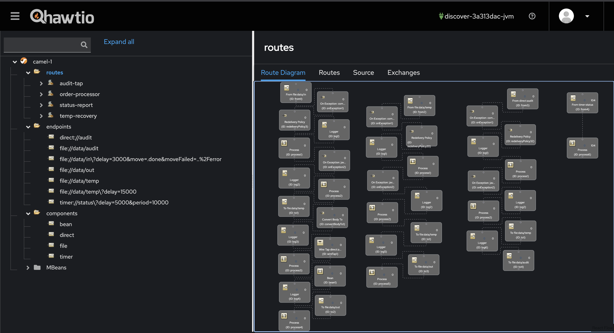
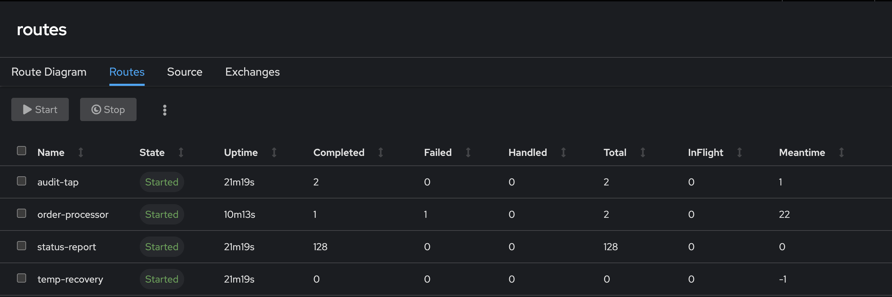
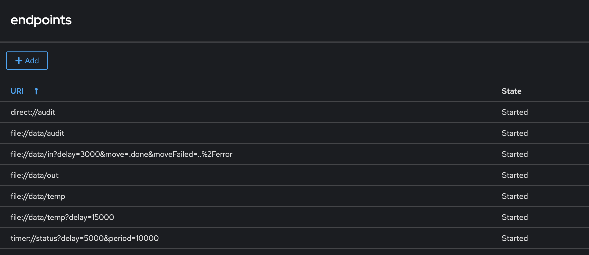
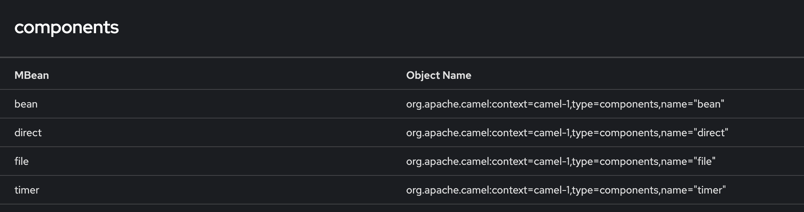
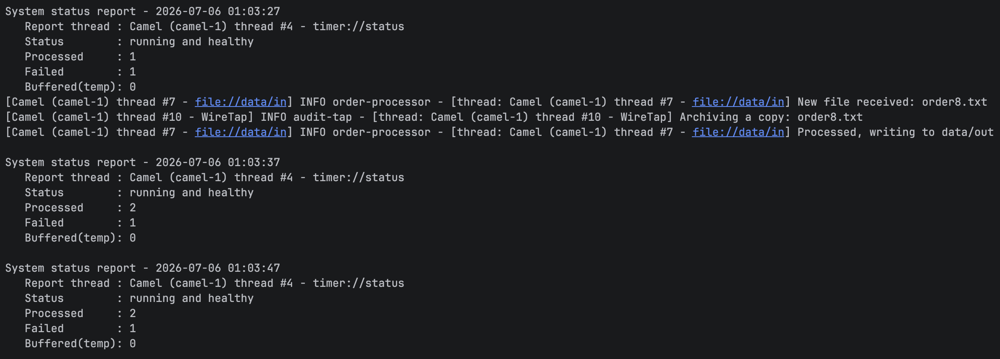
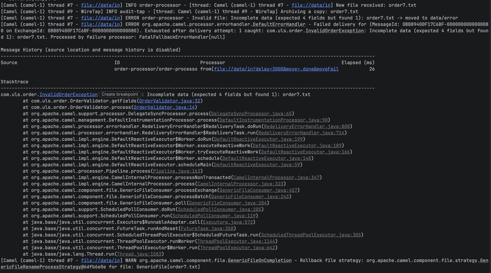
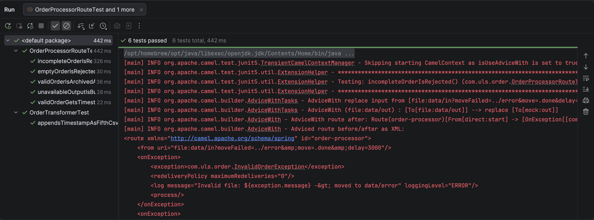
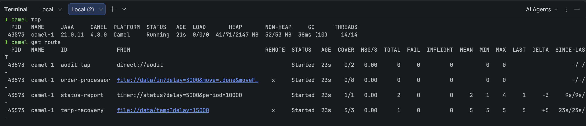
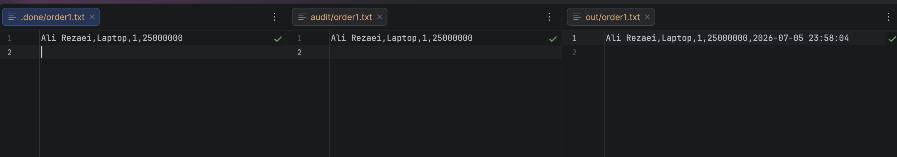
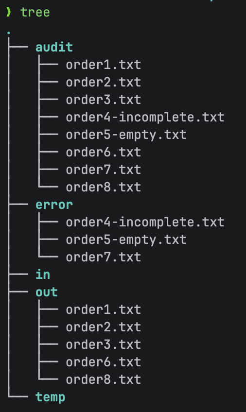

# Screenshots

A visual walkthrough of the Order Integration System — route structure, runtime behavior, and data-flow results.

## Route visualization (Hawtio)

The [Hawtio](https://hawt.io/) web console, connected to the running app through the Camel CLI (`camel hawtio camel-1`).

**Route diagram** — the four routes rendered as live node graphs.

**Routes & statistics** — per-route state and message counters (completed / failed / total).

**Endpoints** — every endpoint URI registered by the routes.

**Components** — the Camel components in use (`bean`, `direct`, `file`, `timer`).

## Runtime & monitoring

**Console output** — the periodic status report together with processing logs.

**Error handling** — an incomplete order rejected with `InvalidOrderException` and routed to `data/error`.

**Test results** — the JUnit 5 suite (6 tests) passing.

**CLI monitoring** — `camel top` and `camel get route` from the terminal.

## Data-flow result

**Order transformation** — the same order across stages: `.done` (input), `audit` (raw copy), and `out` (timestamp appended).

**Data folders** — how files are distributed after a run (`out` / `error` / `audit`).

